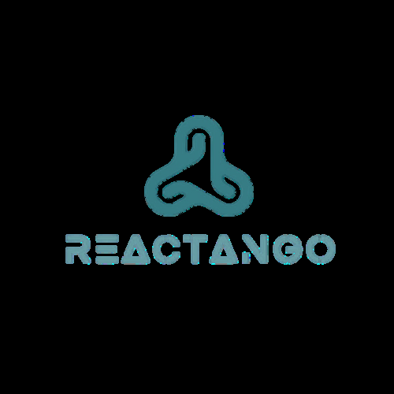

<div align="center">
  
  
  # Reactango: Full Stack Framework
  ## TanStack Router + Django
  
  [](https://www.npmjs.com/package/reactango)
  [](https://pypi.org/project/reactango/)
  [](https://opensource.org/licenses/MIT)
</div>

Reactango is a modern full-stack framework that seamlessly combines the power of React with TanStack Router on the frontend and Django's robust backend capabilities. Designed for rapid development, scalability, and maintainability, Reactango bridges the gap between modern frontend frameworks and battle-tested backend solutions.

## 🚀 Features

### Frontend Excellence
- **React 18+** with modern hooks and concurrent features
- **TanStack Router** for type-safe, declarative routing with advanced features like:
  - Nested layouts and route hierarchies
  - Built-in search params and route validation
  - Code splitting and lazy loading
  - Route-level data loading and caching
- **TypeScript** for enhanced developer experience and type safety
- **Vite** for lightning-fast development and optimized production builds

### Backend Power
- **Django** with REST framework for robust API development
- **Authentication & Authorization** built-in with Django's security features
- **Database Flexibility** supporting both SQL and NoSQL databases
- **Admin Interface** for easy content management
- **Scalable Architecture** following Django best practices

### Developer Experience
- **Hot Module Replacement (HMR)** for instant feedback during development
- **Docker Support** for consistent development and deployment environments
- **TypeScript Integration** across the full stack
- **Automated Code Generation** for API endpoints and React components

## 📁 Project Structure

```
reactango-project/
├── api/                          # Django backend
│   ├── __init__.py
│   ├── admin.py                  # Admin interface configuration
│   ├── apps.py                   # App configuration
│   ├── models.py                 # Database models
│   ├── urls.py                   # API URL routing
│   ├── views.py                  # API views and endpoints
│   └── welcome/                  # Sample app module
│       ├── models/
│       │   └── welcome.py        # Welcome model definitions
│       ├── urls.py               # Module-specific URLs
│       └── views.py              # Module-specific views
├── app/                          # React frontend
│   ├── app.css                   # Global styles
│   ├── root.tsx                  # App root component
│   ├── routes/                   # TanStack Router routes
│   │   └── home.tsx              # Home page component
│   ├── routes.ts                 # Route definitions
│   └── welcome/                  # Welcome page components
│       ├── logo.svg
│       └── welcome.tsx
├── config/                       # Django configuration
│   ├── __init__.py
│   ├── asgi.py                   # ASGI configuration
│   ├── settings.py               # Django settings
│   ├── urls.py                   # Main URL configuration
│   └── wsgi.py                   # WSGI configuration
├── public/                       # Static assets
├── docker-compose.yml            # Docker composition
├── Dockerfile                    # Container configuration
├── manage.py                     # Django management script
├── package.json                  # Node.js dependencies
├── requirements.txt              # Python dependencies
├── react-router.config.ts        # TanStack Router configuration
├── tsconfig.json                 # TypeScript configuration
└── vite.config.ts                # Vite build configuration
```

## 🛠️ Installation

### Prerequisites
- **Node.js 18+** and **pnpm** (recommended) or npm
- **Python 3.8+** and pip
- **Docker** (optional, for containerized development)

### Quick Start

#### 1. Install Reactango CLI
```bash
# Install globally via npm
npm install -g reactango

# Or install globally via pip
pip install reactango
```

#### 2. Create a New Project
```bash
# Create new project
reactango create my-awesome-app
cd my-awesome-app
```

#### 3. Install Dependencies
```bash
# Install Python dependencies
pip install -r requirements.txt

# Install Node.js dependencies
pnpm install
```

#### 4. Start Development Server
```bash
# This command starts both Django backend and React frontend
pnpm run dev
```

Your application will be available at:
- **Frontend**: http://localhost:5173
- **Backend API**: http://localhost:8000
- **Django Admin**: http://localhost:8000/admin

## 🐳 Docker Development

For a consistent development environment across different machines:

```bash
# Build and start all services
docker-compose up --build

# Run in detached mode
docker-compose up -d

# Stop all services
docker-compose down
```

## 📖 Usage Examples

### Setting Up a New API Endpoint

**Django Backend (api/views.py)**:
```python
from rest_framework.decorators import api_view
from rest_framework.response import Response

@api_view(['GET', 'POST'])
def user_profile(request):
    if request.method == 'GET':
        return Response({
            'username': request.user.username,
            'email': request.user.email
        })
    # Handle POST request...
```

**React Frontend (app/routes/profile.tsx)**:
```typescript
import { createFileRoute } from '@tanstack/react-router'

export const Route = createFileRoute('/profile')({
  component: ProfileComponent,
  loader: async () => {
    const response = await fetch('/api/user-profile/')
    return response.json()
  }
})

function ProfileComponent() {
  const data = Route.useLoaderData()
  
  return (
    <div>
      <h1>Welcome, {data.username}!</h1>
      <p>Email: {data.email}</p>
    </div>
  )
}
```

### Adding Authentication

Reactango comes with built-in authentication patterns:

```typescript
// app/hooks/useAuth.ts
export function useAuth() {
  const [user, setUser] = useState(null)
  
  const login = async (credentials) => {
    const response = await fetch('/api/auth/login/', {
      method: 'POST',
      headers: { 'Content-Type': 'application/json' },
      body: JSON.stringify(credentials)
    })
    const userData = await response.json()
    setUser(userData)
  }
  
  return { user, login }
}
```

## 🏗️ Available Scripts

### Development
- `pnpm run dev` - Start both frontend and backend development servers
- `pnpm run dev:frontend` - Start only the React development server
- `pnpm run dev:backend` - Start only the Django development server

### Building
- `pnpm run build` - Build frontend for production
- `pnpm run preview` - Preview production build locally

### Django Management
- `python manage.py migrate` - Run database migrations
- `python manage.py createsuperuser` - Create Django admin user
- `python manage.py collectstatic` - Collect static files for production

### Testing
- `pnpm run test` - Run frontend tests
- `python manage.py test` - Run Django tests

## 🔧 Configuration

### Environment Variables

Create a `.env` file in your project root:

```env
# Django settings
DEBUG=True
SECRET_KEY=your-secret-key-here
DATABASE_URL=sqlite:///db.sqlite3

# Frontend settings
VITE_API_BASE_URL=http://localhost:8000

# Optional: Database configuration
POSTGRES_DB=reactango_db
POSTGRES_USER=reactango_user
POSTGRES_PASSWORD=your_password
```

### Customizing Routes

TanStack Router configuration in `react-router.config.ts`:

```typescript
import { defineConfig } from '@tanstack/router-vite-plugin'

export default defineConfig({
  routeFilePrefix: '/routes',
  generatedRouteTree: './app/routeTree.gen.ts',
  quoteStyle: 'single',
})
```

## 🚀 Deployment

### Production Build

```bash
# Build frontend
pnpm run build

# Collect Django static files
python manage.py collectstatic --noinput

# Run database migrations
python manage.py migrate
```

### Docker Deployment

```bash
# Build production image
docker build -t reactango-app .

# Run container
docker run -p 8000:8000 reactango-app
```

## 📚 Learning Resources

- **[TanStack Router Documentation](https://tanstack.com/router/latest)** - Comprehensive guide to TanStack Router
- **[Django REST Framework](https://www.django-rest-framework.org/)** - Building APIs with Django
- **[React Documentation](https://react.dev/)** - Official React documentation
- **[TypeScript Handbook](https://www.typescriptlang.org/docs/)** - TypeScript fundamentals

## 🤝 Contributing

We welcome contributions! Please see our [Contributing Guide](CONTRIBUTING.md) for details.

1. Fork the repository
2. Create your feature branch (`git checkout -b feature/amazing-feature`)
3. Commit your changes (`git commit -m 'Add some amazing feature'`)
4. Push to the branch (`git push origin feature/amazing-feature`)
5. Open a Pull Request

## 📦 NPM Package

Install Reactango as a dependency in your existing project:

```bash
npm install reactango
```

Visit the [NPM package page](https://www.npmjs.com/package/reactango) for detailed installation and usage instructions.

## 🐍 PyPI Package

Install Reactango's Python utilities:

```bash
pip install reactango
```

Check out the [PyPI package page](https://pypi.org/project/reactango/) for Python-specific documentation and examples.

## 📄 License

This project is licensed under the MIT License - see the [LICENSE](LICENSE) file for details.

## 🙏 Acknowledgments

- **TanStack Team** for the amazing router library
- **Django Software Foundation** for the robust web framework
- **React Team** for the revolutionary UI library
- **Vite Team** for the fast build tool

---

**Built with ❤️ by GLADDYDEV for the full-stack development community**

For more information, visit our [documentation](https://reactango.dev) 